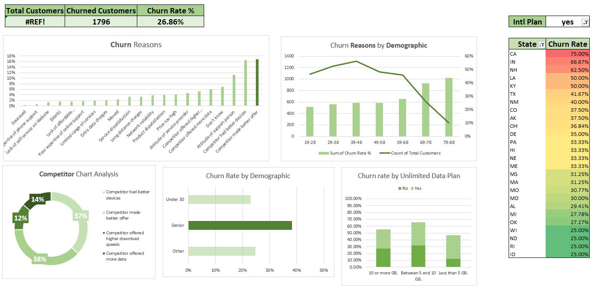
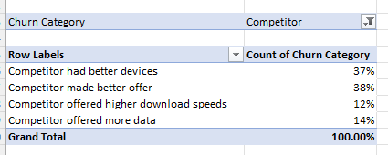
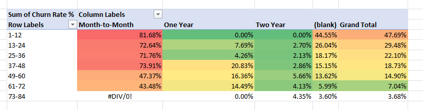
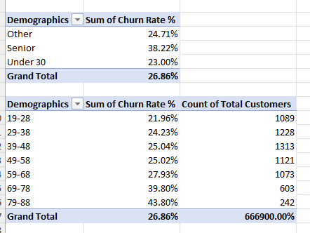

# Customer Turnover Analysis Project

This project focuses on analyzing customer turnover data to identify key reasons for customer churn, demographic trends, and competitor impacts. The project involves data cleaning, exploratory analysis, and creating visual dashboards to provide actionable insights.

## Table of Contents

- [Overview](#overview)
- [Data Cleaning and Preparation](#data-cleaning-and-preparation)
- [Exploratory Data Analysis (EDA)](#exploratory-data-analysis-eda)
- [Key Insights](#key-insights)
- [Dashboard and Visualizations](#dashboard-and-visualizations)
- [Skills Applied](#skills-applied)
- [Conclusion](#conclusion)

## Overview

The objective of this project was to analyze a large dataset of customer information to understand the reasons behind customer churn, demographic factors influencing turnover, and competitive pressures affecting customer retention. 

## Data Cleaning and Preparation

We began the project by cleaning and preparing the data. Key steps included:

1. **Handling Duplicates**: Removed duplicate entries to ensure data accuracy.
2. **Data Formatting**: Converted the raw data into structured tables to facilitate easier analysis.
3. **Data Enrichment**: Added new columns using `IF` statements and nested `IFs` to classify data into meaningful categories (e.g., age groups, customer segments).

## Exploratory Data Analysis (EDA)

EDA was conducted using various pivot tables and visualizations to explore different aspects of customer churn:

1. **Churn Reasons**: We examined multiple reasons contributing to customer churn and their respective frequencies.
2. **Demographic Analysis**: Analyzed churn rates across different demographic segments such as age groups and senior status.
3. **Competitor Analysis**: Investigated the impact of competitor actions (e.g., better devices, offers, data plans) on customer churn.

## Key Insights

From our analysis, several key insights emerged:

- **Churn Rates by Demographic**: Seniors showed the highest churn rate at 38.22%, suggesting a targeted retention strategy may be necessary for this group.
- **Competitor Impact**: A significant portion of churn (37% and 38%) was due to competitors offering better devices and offers, respectively. 
- **Contract Type Analysis**: Customers on a month-to-month contract had a significantly higher churn rate compared to those on one or two-year contracts, highlighting the importance of contract length in customer retention.

## Dashboard and Visualizations

To effectively communicate the findings, we compiled the results into a comprehensive dashboard.

The dashboard includes:

- **Churn Reasons**: A bar chart detailing the primary reasons customers are leaving.
- **Churn Reasons by Demographic**: A combination of line and bar charts to show churn distribution across age groups.
- **Competitor Analysis**: A pie chart illustrating the percentage of churn attributed to various competitor actions.
- **Churn Rate by Demographic and Unlimited Data Plan**: Bar charts analyzing churn rates segmented by demographic and data plan usage.
- - **Churn Rate by State**: Filtered the top 25 states with the highest churn rate.

Additionally, pivot tables were utilized to drill down into the data:

### Pivot Tables
We showcased our use of pivot tables in analysing the large datasets provided along with comparing the churn rate with these different metrics.

1. **Competitor Churn Analysis**  
   

2. **Churn Rate by Contract Type**  
   

3. **Churn Rate by Demographic and Age Group**  
   

These visuals provide a granular view of the factors driving churn and allow for a more nuanced understanding of customer behavior.

## Skills Applied

Throughout this project, several key skills were applied and developed:

- **Data Cleaning and Preparation**: Mastery in handling large datasets, removing duplicates, and preparing data for analysis.
- **Advanced Excel Functions**: Proficiency in using `IF` statements, nested `IFs`, and other Excel formulas to manipulate and analyze data.
- **Pivot Tables**: Expertise in creating and interpreting pivot tables to explore various dimensions of the data.
- **Data Visualization**: Created compelling visualizations using Excel to present complex data insights in an accessible format.
- **Dashboard Design**: Developed a comprehensive dashboard to effectively communicate insights to stakeholders.

## Insights

This project yielded several important insights that can directly inform strategic decisions aimed at reducing customer churn:

1. **Demographic-Specific Churn**: The analysis highlighted that churn rates are significantly higher among certain demographic groups, particularly seniors. With a churn rate of 38.22%, seniors represent a critical segment where focused retention strategies could have a meaningful impact. For example, tailoring services or customer support specifically for older customers could address their unique needs and potentially reduce churn in this group.

2. **Impact of Competitor Actions**: A substantial proportion of customers cited better offers and devices from competitors as reasons for leaving. This finding suggests that competitive pricing and technology offerings are major drivers of churn. Companies can mitigate this by enhancing their product offerings, introducing competitive pricing models, and improving the perceived value of their services.

3. **Contract Type and Customer Retention**: The data clearly indicates that customers on month-to-month contracts are more prone to churn compared to those on longer-term contracts. This trend suggests that encouraging customers to commit to longer contracts could significantly reduce churn rates. Strategies such as offering incentives for long-term commitments or enhancing the benefits of staying on a month-to-month plan could be explored to improve retention.

4. **Importance of Data Plans**: The analysis of churn rates by data plan usage revealed that customers with limited data plans had higher churn rates than those with unlimited plans. This insight suggests a potential opportunity to reduce churn by promoting unlimited data plans or increasing the data allowance on limited plans, thereby enhancing customer satisfaction and reducing the likelihood of switching to competitors.

5. **Regional Variations in Churn**: The state-by-state analysis uncovered significant variations in churn rates, with some states exhibiting much higher rates than others. This regional disparity suggests that localized strategies may be necessary to address unique market dynamics, competitive pressures, or customer preferences within different geographic areas.

6. **Customer Satisfaction and Support**: Among the reasons for churn, customer dissatisfaction due to service-related issues and support experiences was also notable. Addressing these areas through improved customer service training, better issue resolution processes, and proactive customer engagement could help in reducing churn rates associated with service dissatisfaction.

## Conclusion

The customer turnover analysis project provided a deep dive into the various factors influencing churn, offering a robust foundation for developing targeted strategies to enhance customer retention. By examining the data from multiple angles—demographic, competitive, contractual, and regional—this project has illuminated several key drivers of customer churn.

One of the most significant takeaways is the need for a nuanced approach to customer retention. It's not enough to apply a one-size-fits-all strategy; rather, understanding the specific pain points and preferences of different customer segments can lead to more effective interventions. For instance, seniors, who showed the highest churn rates, may benefit from more personalized customer service and targeted communication about their specific needs and preferences. Similarly, offering competitive pricing and device options could counteract the influence of competitors, a major churn driver identified in this analysis.

The insights gained from this project also underscore the importance of contract management in retention strategies. Encouraging customers to opt for longer contracts through compelling offers or value-added services could mitigate the risk of churn. Additionally, the analysis of data plan usage points to the potential benefits of promoting unlimited or more generous data plans to enhance customer satisfaction.

From a regional perspective, recognizing the unique market dynamics and customer preferences that vary across states can help in designing more localized and effective retention strategies. By addressing state-specific factors contributing to churn, companies can better tailor their efforts to retain customers in different markets.

Overall, this project has highlighted the value of data-driven decision-making in understanding and addressing customer churn. The skills developed, such as data cleaning, pivot table analysis, advanced Excel functions, and data visualization, are not only applicable to this project but are also essential tools for any data analysis task. These capabilities enable organizations to transform raw data into actionable insights, driving strategic decisions that can improve customer loyalty and reduce turnover.
